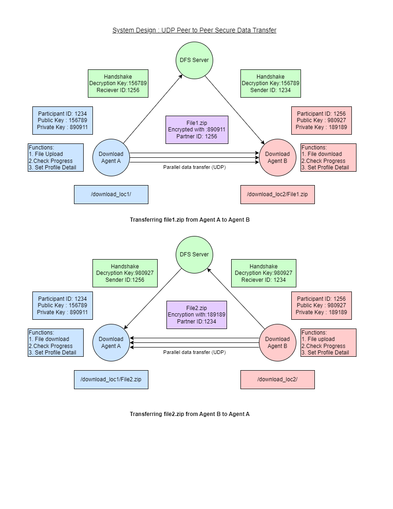
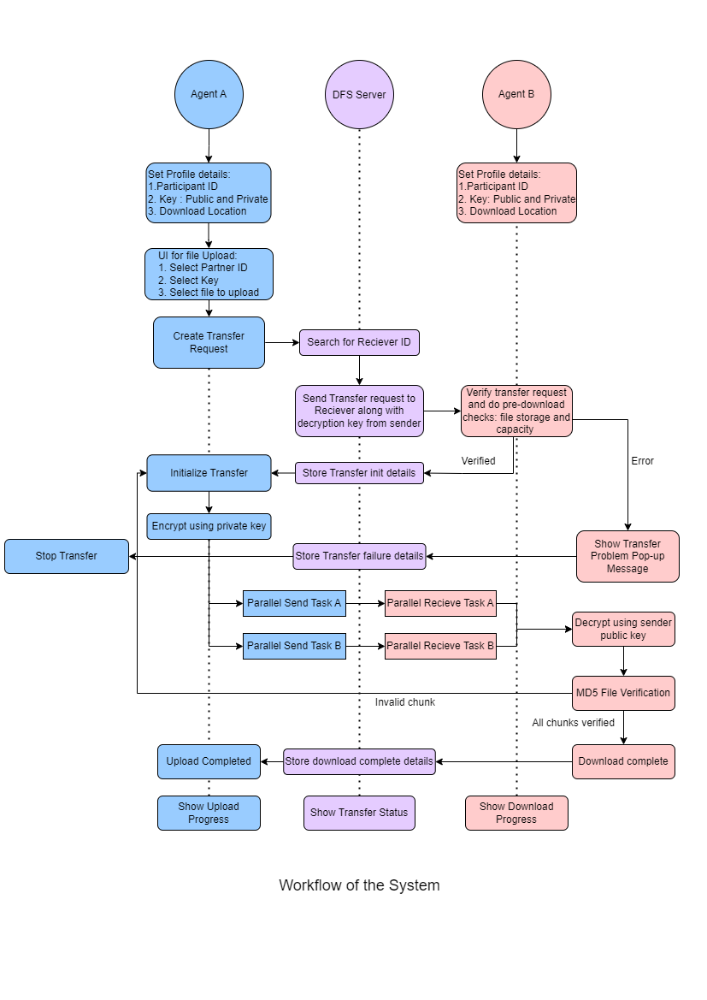

# UDP Peer to Peer Secure Data Transfer
## Tasks
| Task | Date Started | Date Completed | Notes | PRs | Issue |
| -------- | ------- | ----------|-----|-----|-------- |
| Repo Creation | 05-02-2022 | 05-02-2022 | | | |
| Requirement Doc | 06-02-2022 | 09-02-2022 | | | |

## Overview

This project aims to implement secure, high-speed peer-to-peer data transfer between two agents (Data Foundation and Partner) using NodeJS servers. The transfer uses UDP for data transfer and TCP for transfer quality control. The project involves creating Data Transfer Profiles for each agent, which include details such as IP addresses, host names, and port details. The data transfer is initiated by setting up a transfer request with parameters such as number of threads, IP addresses, and schedule time. The project includes a web-based monitoring system to monitor the data transfer session. Additionally, the project involves integrating the Data Foundation with the file system and MinIO.

**Use cases for this platform include**:

- Educational: The platform could be used in educational institutions for transferring large amounts of data, such as video lectures or research papers, between teachers and students or between different departments within the same institution.
- Research: Researchers can use the platform to transfer large amounts of data, such as scientific data or simulations, between different research institutions or between researchers working on the same project.
- Industry: Companies could use the platform for secure, high-speed transfer of large amounts of data, such as financial data or customer data, between different departments within the company or between different companies.
- Community building: The platform could be used to transfer large amounts of data, such as event videos or community resources, between different communities or between members within a community.
- Competition: The platform could be used for secure, high-speed data transfer during competitions, such as programming competitions, where large amounts of data, such as code submissions or testing data, need to be transferred quickly and securely between participants and organizers.

---

## Requirements

UDP Peer to Peer Secure Data Transfer
- Secure high speed peer to peer data transfer from/to Data Foundation Server
- Data Transfer between two Agents (Data Foundation and Partner ) with the help of NodeJS servers
    - UDP for data transfer
    - TCP for transfer quality control
- Data Foundation and Partner Data Tansfer Profile detail:
    - Data Foundation Agent(s) Details: Partner ID, Partner Public Key, Partner Private Key, Data Send / Receive directory, Host name, IP Address, port details
    - Partner Agent(s) Details: Partner ID, Partner Public Key, Partner Private Key, Data Send / Receive directory, Host name, IP Address, port details
- Data Transfer Request Setup ( Sender and Receiver DT Profiles, Transfer Configuration: (#threads, IP addresses, ports, schedule time, # of files, Total Files Size, md key)
- Add Files
- Schedule/initiate Data Transfer Request
- DT Profile key verification. On success, Initiate Data transfer (send / receive)
- Data Transfer Session Monitor ( Web based monitoring)
- Data Foundation Integration: File System Integration + MinIO Integration

## Technical Requirements

### Software Requirements
The project will mostly be based on Node js. The parsing, validation, uploading, and
downloading of the data will be handled with dedicated Node js objects or modules.
The UI section of the project will be based on javascript, in particular , react js, which enables us to create a suitable reactJS web application allowing client-side users to easily upload and download files. JSon file can be used to keep track of the necessary configurations of the file transfer system.

--- 

### Hardware Requirements
We will require three systems. One will be acting as client uploading the file.The other will be acting as a monitoring system at the DFS Server for tracking and monitoring data transfer. Another for acting as client downloading the file. Systems should have capable enough processor as applications can handle information at a faster speed. (preferably with 4 core or more). A high speed internet connection will be needed.

## Scope
- Using NodeJS servers, two agents (Data Foundation and Partner) can exchange data at rapid speeds between each other while being secure.
- Data Transfer Session Monitor ( Web based monitoring)
- Data Foundation Integration: File System Integration + MinIO Integration

## System Design 

    

### **Workflow of the System**

The traditional mode of file transmission involves multiple steps and can be time-consuming. To address this issue, our team has developed a point-to-point transfer mode that enables end-to-end file transmission between users in a single step. Here's how it works:

#### Preqrequisites for setup:
1. Create Participant ID for each client node.
2. Generate Public and Private Keys for each user and store on the database of DFS Server.
3. Each client has to set their profile details's that is participant ID and download directory. ( They should have enough space for downloading the entire file)

---
- Step 1. Agent A logs into the website(fetches its own Public and Private key) and navigates to the "Point-to-Point" transfer page and clicks "Start to Transfer File" and enters the recipient's ID. This initiates a Handshake with Agent B through the DFS Server and creates a request to the DFS server to find the recipient's ID.

- Step 2. The server searches for the recipient's information (Public and Private Key) and provides Agent A with the recipient's ID and Key. Agent A then prepares the transfer request along with the decryption key(A's public key) from the database and sends it to the recipient.

- Step 3. Agent B receives the transfer request and verifies it. Upon successful verification, Agent B sends a confirmation to the server.

- Step 4. The server receives the confirmation from Agent B and informs Agent A, who can now initiate the transfer.

- Step 5.  Agent A breaks down the file into chunks and creates parallel threads to send each chunk encrypted with A's private key. The receiver that is Agent B recieves each chunk on parallel threads and decrypts using A's public key. We will use MD5 to verify integrity of each file chunk, if corrupted send a Negative Acknowledgement to resend the chunk.

- Step 6. The server monitors the upload and download progress of the transfer and provides real-time updates from Agent A and Agent B.

- Step 7. Once the transfer is complete, the recipient can open the local directory and view the received file. The server also updates the transfer history, which can be accessed by both parties to view the status of previous transfers.

By adding a server that monitors the transfer process, both parties can view the progress of the transfer in real-time and have access to all transfer history in one centralized location. This added level of transparency and accountability helps to ensure that all transfers are completed successfully and provides a convenient way to track transfer history.

    

